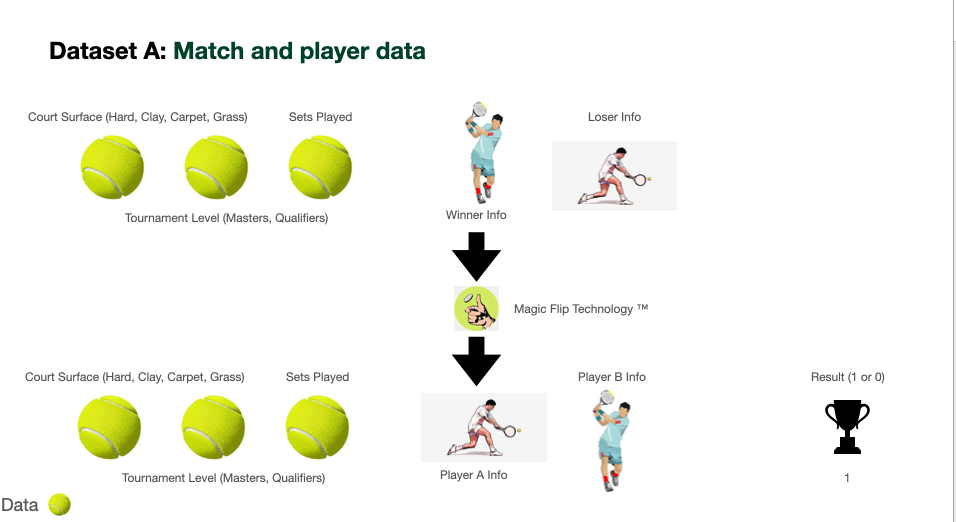
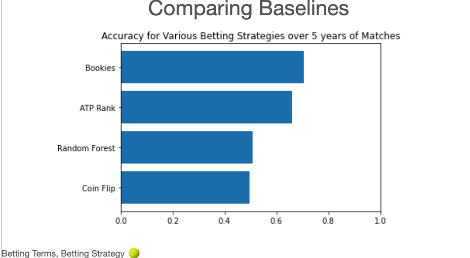

# OVERVIEW #

A series of experiments using various types of data on random forrests to predict the outcome of tennis matches.

# DATA # 

Initially built a dataframe of ~ 15,000 ATP matches from a Jeff Slackmann database containing match attributes (like court surface, tournament level, and sets played) as well as player "measureables" (age, dexterity, rank, etc) of men's tennis players from all matches from 2011-2015. A vast majority of Slackmann's data were too specific and therefore not usable for making predictions. For example, knowing the number of aces the winner or loser scores isn't something I can reliably use for predicting an unseen match. Match attributes like court surface & tournament type (Master, Qualififiers, Challenger, Tour500, etc.) were one-hot encoded for prediction.


# "CHALLENGES" FROM THE DATA #

The Slackmann dataset was organized by winner and labeled accordingly. This meant that the winner's info was always provided first and the loser's info was always provided second. Considering that a random forrest looks for patterns, the data seemed to present an issue: the first player wins 100% of the time. 

To combat this, I shuffled the data using the Bernoulli distribution. That is, flipped a coin and then shuffled them or left the information alone, making note of which were changed and which were unchanged. This was then applied to each and every match in preparation for the random forrest predictions. 



```python
updatereversedorder = [
    'clay', 'grass', 'hard',
    'A', 'D', 'F', 'G', 'M', 'best_of', 
    'loser_ht', 'loser_age','loser_rank','L2', 'R2', 'U2', 
    'winner_ht', 'winner_age','winner_rank', 'L1', 'R1', 'U1']

def updateflipornotnewframe(row):
    newframe = []
    flip = np.random.choice([0,1], p=[0.5,0.5])
    
    if flip == 0: #player info does not shuffle, player A is winner (default)
        row['result'] = 0
        newframe.append(row)
        
    else:   #winner info goes into player B spot
        row = row.reindex(updatereversedorder)
        row['result'] = 1
        newframe.append(row)
        

    return pd.DataFrame(newframe)
```


After establishing several baselines (flipping a coin, betting the underdog, choose the higher-ranked player) it was clear that I had reached a dead end.


Conclusion: there's no reliable pattern in ATP ranking, age, height, dexterity, etc for predicting match outcome.  

# INCORPORATING ODDS-MAKERS' DATA #


After seeing random forrest results, a second dataframe was constructed, ditching player "measureables" for various odds-makers data and aggregate odds. The two "most-complete" sets of odds-makers odds were used, along with the average.


# INSIGHTS #

Almost immedately it became apparent that the odds-makers agree in unison and unanimity. 

**Surely** there's bound to be a difference of opinion -- and it is purely opinion -- between bookmakers over tens of thousands of matches? While the actual odds vary, the likely winner (and loser) are identical across bookmakers. It looked like their overall accuracy, over ~15000 matches, sat at an impressive 67% accuracy.

Armed with this knowledge, I set out to explore if we could use implied odds to be the underdogs on favorable matches to form a profitable betting strategy.

My progress in teaching a computer how to bet can be seen in the upcomming "betting" directory I'm currently working on. Thanks! 


Data provided by Jeff Slackmann:
# License

<a rel="license" href="http://creativecommons.org/licenses/by-nc-sa/4.0/"></a><br /><span xmlns:dct="http://purl.org/dc/terms/" href="http://purl.org/dc/dcmitype/Dataset" property="dct:title" rel="dct:type">Tennis databases, files, and algorithms</span> by <a xmlns:cc="http://creativecommons.org/ns#" href="http://www.tennisabstract.com/" property="cc:attributionName" rel="cc:attributionURL">Jeff Sackmann / Tennis Abstract</a> is licensed under a <a rel="license" href="http://creativecommons.org/licenses/by-nc-sa/4.0/">Creative Commons Attribution-NonCommercial-ShareAlike 4.0 International License</a>.<br />Based on a work at <a xmlns:dct="http://purl.org/dc/terms/" href="https://github.com/JeffSackmann" rel="dct:source">https://github.com/JeffSackmann</a>.

In other words: Attribution is required. Non-commercial use only. 
